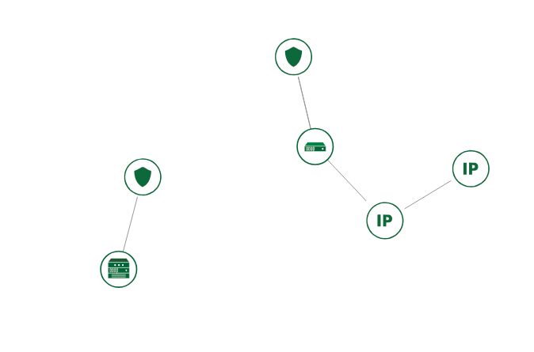

# Ansible Workshop deployment
#### Table of Contents

1. [Overview](#overview)
2. [Requirements](#requirements)
    * [Software](#software)
    * [Cloud environment](#cloud-environment)
    * [Virtual machine images](#virtual-machine-images)
3. [Usage](#usage)
4. [Technical details](#technical-details)
    * [Tricks used](#tricks-used)
    * [Caveats](#caveats)
5. [Contributors](#contributors)

## Overview

This repository contains Ansible playbooks for deploying a bastion host and a
set of VMs accessible only from the bastion host. Used in an ansible workshop.

**If you are going to use the code here as an example, please read the "Caveats"
chapter below.**

## Requirements

### Software

If you use ansible in a virtualenv on RHEL with selinux setup the venv with
"--system-site-packages". This was needed with python2, RHEL7 and selinux 
enforcing.

```bash
$ virtualenv --system-site-packages os_client_system_packages
```

* Ansible >= 2.2
* shade >= 1.8.0

For instructions on how to install Ansible, see [the official
documentation](https://docs.ansible.com/).

Shade is a client library used by Ansible to communicate with OpenStack clouds.
The easiest way to install it is using pip:

```bash
$ pip install shade
```

Or just

```bash
$ pip install -r requirements.txt
```

### Cloud environment

You will also need access to an OpenStack cloud. The project you use for
deployment needs to have a network and a router in place. If floating IPs are
available for your project then this should already be the case.

The OpenStack installation needs to have at least Heat and Neutron in addition
to Nova. The version of the Heat template used here is for Liberty. If you want
to run against an older version of OpenStack, you will need to modify the
template version. It is not guaranteed that the template will work against
older versions of OpenStack. Contact your OpenStack operator's support if you
are unsure whether the cloud fulfills these requirements.

Make sure the project you use for the stack has sufficient quota. You will need
sufficient quota for these additional resources on top of whatever you already
have running in the project:

  * Four virtual machines (the exact quota requirement depends on the flavors)
  * One floating IP
  * Two security groups and the handful of rules in those security groups

### Virtual machine images

The database backend deployment has been tested to work with CentOS 7. Other
distributions probably work as well.

## Usage

First you'll need to clone this repository to a directory on your machine. We
will refer to the root of the cloned repository with `ansible-workshop-demo`
later in this text.

Install the third party Ansible roles used:

```bash
$ ansible-galaxy -r requirements.yml install
```

You will need to get an openrc file from OpenStack so that Ansible can interact
with it. The easiest way to get it is to login to the web interface and go to
Compute -> Access & Security -> API Access -> Download OpenStack RC File. Once
you have the file, you will need to source it (the name of the file may be
different):

```bash
$ source openrc.sh
```

After that you can fill in the parameters for the Heat stack. First copy the
example Heat parameter file to your current working directory:

```bash
$ cd ansible-workshop-demo
$ cp files/example-heat-params.yml playbooks/my-heat-params.yml
```

Edit the file with your favorite editor and fill in all the variables. You can
find documentation about the variables in the Heat template under
`files/bastion-heat-stack.yml`.

Creating the controlmaster socket:
```bash
$ mkdir cm_socket
```

Once you have completed the steps above, you are ready to spin up the stack in
OpenStack. You will need to specify the name of the network you filled in in
your Heat parameters:

```bash
$ ansible-playbook site.yml \
  -e "bastion_network_name=<the openstack network shared by instances>"
```

The default user account name used to log in to virtual machines is
"cloud-user". If the images you are using have a different default user account
name, then you will need to also set the `vm_user_account` variable.

You can find out the public IP address of the application after the playbook
run has finished by looking at the automatically generated `ansible_inventory`
file. The public IP is the value of `ansible_ssh_host` for `bastion_node`:

```bash
$ cat ansible_inventory
```

Once the playbook run finishes, you can access the deployed application by
pointing your browser to its public IP address.

```bash
$ # the following help if one rebuilds the nodes (don't run every time..):
$ # rm ~/.ssh/known_hosts
$ # rm -v /home/ansible*/.ssh/known_hosts # in case you need to cleanup users
```

For loop to copy generated ssh keys and add to ansible_nodes. Also spawn a backdoor sshd on TCP 2222.
```bash
$ # add a user, add the user's ssh key to it
$  for i in $(seq 0 3); do \
     echo "## user $i"; \
     echo sudo cp -v /home/ansible$i/.ssh/id_rsa.pub /tmp/authorized_key; \
     echo scp /tmp/authorized_key ansible_node$i:/tmp/authorized_keys; \
     echo ssh ansible_node$i sudo cp -v /home/cloud-user/.ssh/authorized_keys /root/.ssh/authorized_keys; \
     echo ssh ansible_node$i sudo mv -v /tmp/authorized_keys /home/ansibleworkshop/.ssh/; \
     echo ssh ansible_node$i sudo rm /home/ansibleworkshop/.ssh/known_hosts; \
     echo ssh root@ansible_node$i sudo chown -v ansibleworkshop /home/ansibleworkshop/.ssh/authorized_keys; \
     echo ssh root@ansible_node$i sudo chmod -v 600 /home/ansibleworkshop/.ssh/authorized_keys; \
     echo ssh ansible_node$i sudo /sbin/sshd -f /etc/ssh/sshd_config -p 2222; \
     done
```

We also need to add the authorized_keys from the user to the cloud-user


## Technical details

The playbooks here will spin up the following stack:



The setup of the demo is split into stages that are implemented as separate
playbooks. You can find these playbooks under the `playbooks/` directory. These
are all gathered together in the correct order in `site.yml`. The stages are as
follows:

0. Make sure that you have already created vault.yml
1. Start Heat stack
2. Configure bastion host
3. Configure ansible nodes

You can follow the flow of execution by starting from `site.yml` and reading the
included playbooks in the order listed.

### Tricks used

**Start a Heat stack and create an Ansible inventory dynamically out of its
outputs.**

In the `outputs` section of the Heat template, you'll find an example on how to
get data out from Heat after its done with its deployment. This output is
placed into an Ansible variable using the `register` keyword. The variable is
then used to dynamically add the freshly created hosts to Ansible's inventory.
The `add_host` module is used for this. An inventory file is also generated
(`ansible_inventory`), though this is not used during the Ansible run. It can
be used once the stack is running for troubleshooting purposes.

**Connection to hosts with no public IP through a bastion host.**

The virtual machine used to host Bastion node is used as a bastion host to
connect to the ansible nodes. This is achieved by using the ProxyCommand
feature of SSH. The ProxyCommand option is filled in using
`ansible_ssh_common_args` set in the context of the database cluster nodes (see
`group_vars/`).

### Caveats

Some shortcuts were taken to finish these playbooks in time for a live demo, so
if you want to use this repo as an example you should be aware of the following
caveats. First of all a caveat about this list: it is almost certainly not
complete, and there are other things that could be done better as there always
are. As a general principle, you should not copy implementation details from an
example without understanding the implications. PRs are welcome.

 - passwords in capitals and numbers of only 6 chars are insecure
 - ssh-keys without passwords should not to be used
 - running ssh-agents on a bastion host should be analyzed
 - to reduce possibility of ssh MITM attacks do use the ssh known_hosts
 - selinux should not be disabled

## Contributors

  * Johan Guldmyr - https://github.com/martbhell
  * Risto Laurikainen - https://github.com/rlaurika

## Source

The playbook and heat template used here was copied from https://github.com/CSCfi/etherpad-deployment-demo
